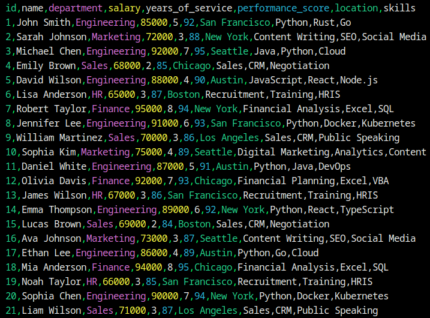

# 🎨 Colored CSV

A beautiful and powerful CSV file viewer with syntax highlighting, written in Rust. Transform your boring CSV files into colorful, easy-to-read masterpieces!

[](https://www.rust-lang.org/)
[](LICENSE)

## ✨ Features

- 🎨 **Syntax Highlighting**: Different colors for headers, numbers, text, and special characters
- 🌓 **Theme Support**: Light and dark themes for comfortable viewing
- 🔍 **Smart Delimiter Detection**: Automatically detects CSV delimiters (comma, tab, semicolon)
- 📊 **Column Alignment**: Properly aligned columns for better readability
- 🚀 **Fast Performance**: Written in Rust for blazing-fast processing
- 🛠️ **Customizable**: Command-line options for various viewing preferences

## 🚀 Installation

### Prerequisites
- Rust 1.70.0 or later
- Cargo (comes with Rust)

### Building from Source
```bash
# Clone the repository
git clone https://github.com/yourusername/colored-csv.git
cd colored-csv

# Build the project
cargo build --release
```

## 💻 Usage

### Basic Usage
```bash
cargo run -- -i test.csv
```

### Command Line Options
```bash
cargo run -- --help
```

Available options:
- `-i, --input <FILE>`: Input CSV file path

### Examples
```bash
# View with light theme
cargo run -- -i test.csv

# Run with logging
RUST_LOG=debug cargo run -- -i test.csv
```


## 🙏 Acknowledgments

### Core Libraries
- [csv-rs](https://github.com/BurntSushi/rust-csv) - Fast and flexible CSV parsing
- [colored](https://github.com/mackwic/colored) - Terminal text coloring
- [clap](https://github.com/clap-rs/clap) - Command-line argument parsing
