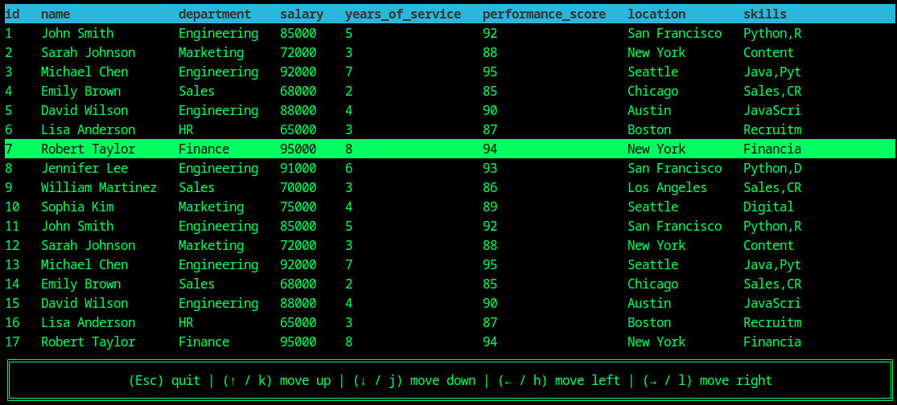
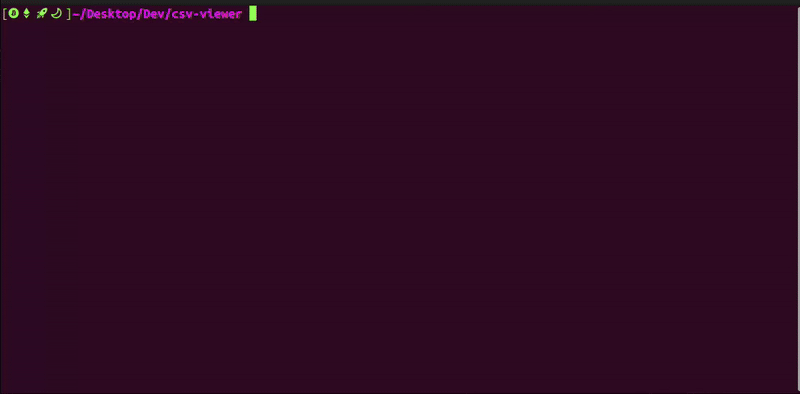

# 🎨 Colored CSV

A beautiful and powerful CSV file viewer with syntax highlighting, written in Rust. Transform your boring CSV files into colorful, easy-to-read masterpieces!

[](https://www.rust-lang.org/)

## ✨ Features

- 🔍 **Smart Delimiter Detection**: Automatically detects CSV delimiters (comma, tab, semicolon)
- 📊 **Column Alignment**: Properly aligned columns for better readability
- 🚀 **Fast Performance**: Written in Rust for blazing-fast processing
- 📱 **Responsive Design**: Adapts to your terminal window size

### Prerequisites
- Rust 1.70.0 or later
- Cargo (comes with Rust)

### Building from Source
```bash
# Clone the repository
git https://github.com/viettran295/csv-viewer.git
cd csv-viewer

# Build the project
cargo build --release
```

## 💻 Usage
```bash
cargo run -- -i examples/test.csv
```

## 📸 Screenshots



## 🎥 Demo

Watch a quick demo of Colored CSV in action:



## 🙏 Acknowledgments

### Core Libraries
- [csv-rs](https://github.com/BurntSushi/rust-csv) - Fast and flexible CSV parsing
- [clap](https://github.com/clap-rs/clap) - Command-line argument parsing
- [ratatui](https://github.com/ratatui-org/ratatui) - Terminal user interface library
